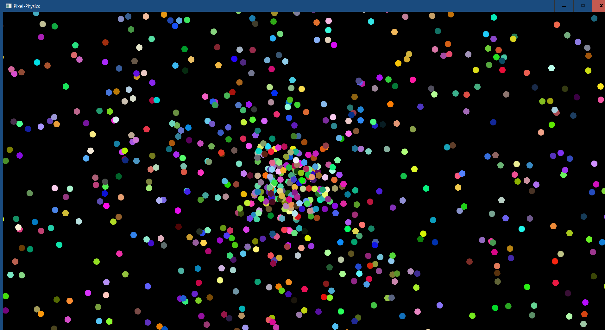

# Pixel-Physics
A simple particle system implemented using the SFML library.

## Features
- Dynamic particle generation and movement
- Particles interact with each other through collisions
- Colorful, visually appealing display

## Requirements
To compile and run the program, you will need to:
- Link the SFML library
- Place the following DLLs in your solution:
  - sfml-graphics-2.dll
  - sfml-window-2.dll

## Screenshot

## Usage
Clone the repository and run the program to see the particle system in action.
